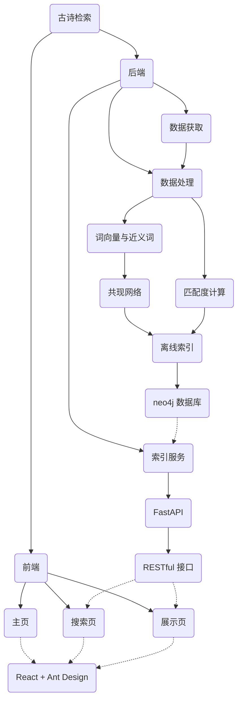

# 期中大作业报告

## 目录

[TOC]

## 环境搭建

后端开发环境为 Python 3.8.11，可在 Python 3.7 到 3.9 上运行。离线计算部分的依赖包见 `backend/lab/requirements.txt`，在线服务部分的依赖包见 `backend/server/requirements.txt`。

后端依赖于 neo4j 数据库以及 neo4j 的 gds 拓展。实际使用版本的是 neo4j 4.3.6 和 gds 1.7.2。

前端开发环境为 Node.js 16.5.0，需要的依赖包见 `frontend/poem-tang/package.json`。在 `frontend/poem-tang` 文件夹内，使用 `yarn install` 可一键完成环境配置。

## 项目结构

项目结构如图：

```
├── backend                     # 后端
│   ├── lab                     # 离线计算（关系挖掘，数据库写入）
│   │   ├── data                # 数据集
│   │   │   └...
│   │   ├── process.ipynb
│   │   └── requirements.txt
│   └── server                  # 在线服务（读取数据库，提供接口）
│       ├── __init__.py
│       ├── graph.py
│       ├── wds.txt
│       └── requirements.txt
└── frontend                    # 前端
    └── poem-tang
        ├── src                 # React 页面及组件
        │   ├──components
        │   │   └...
        │   ├──scripts
        │   │   └...
        │   ├──App.js
        │   └──...
        ├── public
        │   └...
        ├──package.json
        └──...
```

### 后端

后端分为两部分：离线计算和在线服务。

离线计算负责对数据集进行清洗和分析，从古诗中提取词库，挖掘词语之间的近义词关系，评价词语和古诗的匹配度，对古诗进行排名，并将结果写入 neo4j 数据库中。这一部分运行在开发环境中，不在服务器上运行。代码见 `backend/lab/process.ipynb`。

在线服务运行在服务器上，负责从数据库中读取数据，并对外提供 HTTP 接口。代码见 `backend/server/` 文件夹。

### 前端

前端采用 React 开发，负责从服务端提供的接口中获取数据，并向用户展示。代码见 `frontend/poem-tang/` 文件夹。

### 架构图



## 数据挖掘算法

以下记 $\mathcal{W}$ 为所有词语的集合，$\mathcal{P}$ 为所有诗歌的集合。对于 $w\in\mathcal{W}$ ，$p\in \mathcal{P}$ ，记 $w\in p$ 表示词语 $w$ 在诗歌 $p$ 中出现。

### 词库提取

利用 gensim 包提供的 FastText 模型，逐字训练 n-gram 向量与字向量。

然后提取出所有古诗中的二到四字组合，利用 FastText 模型得到词向量 $\mathrm{Vec}_w$。词向量的长度可以表示词语的相对概率，由此得到每个词语的评分：
$$
\mathrm{Score}_{w} = ||\mathrm{Vec}_w || \times \ln (D_w+1)
$$


其中 $D_w$ 是词频。

保留 $\mathrm{Score}_w$ 最高的若干个词语，得到词表。

提取结果见 `backend/server/wds.txt`。

### 近义词挖掘

根据词语的共现关系，建立共现图。认为在同一首诗中共同出现即为共现。
$$
G[w_i;w_j]=\begin{cases}1, &\exists p\in \mathcal{P}, w_i, w_j\in p\\0,&\textrm{otherwise}\end{cases}
$$
此时，共现图的邻接矩阵的每一行可以认为是词语的一个特征向量。对整个邻接矩阵使用 PCA 降维，得到每个词语的词向量。
$$
\mathrm{v}_w^T=G[w]P^T
$$


计算词语间的两两的余弦相似度，取每个词语的前10作为近义词。
$$
Q[w;w']=\mathrm{v}_w\mathrm{v}_{w'}^T\\
\mathcal{S}_w=\{w'|Q[w;w'] > \Delta_{10}\}
$$

### 词语聚类和主题挖掘

按照近义词关系，建立近义词网络。利用 Louvain 算法进行聚类，得到若干个类 $\mathcal{T}_w$，作为词语所属的主题。
$$
\mathcal{T}=\mathrm{argmax} \sum_{w,w'}\left(Q[w;w'] - \frac{1}{2m}\left(\sum_{u\in \mathcal{S}_w}Q[u;w]\right)\left(\sum_{u\in \mathcal{S}_{w'}}Q[u;w']\right)\right)\delta(\mathcal{T}_w,\mathcal{T}_{w'})\\
\begin{align} \textrm{where}\quad
&m=\sum_{w,w'\in \mathcal{S}_{w'}}Q[w;w']\\
&\delta(a,b)=\begin{cases}1,&a=b\\0,&a\ne b\end{cases}
\end{align}
$$
对每一类中的词语，运行 PageRank 算法，将不同词语在主题中的中心度作为重要程度。
$$
\mathrm{PR}_w=\frac{1-d}{|\mathcal{T_w}|}+d\left(\sum_{w'\in \mathcal{S}_w\cap\mathcal{T}_w}\frac{\mathrm{PR}_{w'}Q[w;w']}{L(w)}\right)\\
\textrm{where}\quad L(w)=\sum_{u\in \mathcal{S}_{w}\cap\mathcal{T}_w}Q[u;w]
$$

### 诗歌与词语的匹配度

根据近义词与主题词模型，分别可以计算一首诗与某一个词语的匹配度。

近义词模型认为，一首诗包含某个词语的近义词越多，这首诗和这个词的匹配度越高。优点是计算结果较精确，缺点是可应用的词语范围较窄，对于近义词未在诗中出现的词，无法计算匹配度。
$$
\mathrm{M}[p;w]=\frac{1}{|p|}\sum_{w'\in \mathcal{S_w}\cap p}Q[w;w']
$$

主题词模型认为，一首诗包含某个主题的词在这个主题中的重要程度越高，这首诗越贴合这个主题，与这个主题中的词语的匹配度越高。优点是可应用的词语范围广，缺点是不够精确，对同一主题中词语区分不足。
$$
\mathrm{R}[p;w]=\frac{1}{|\mathcal{T}_w\cap p|}\sum_{w'\in\mathcal{T}_w\cap p}\ln(1+\mathrm{PR}_{w'})
$$
最终的匹配度是二者的加权平均：
$$
\begin{align}
\mathrm{Match}[p;w]&=\alpha \mathrm{M}[p;w]+(1-\alpha)\mathrm{R}[p;w]\\
&=\frac{\alpha}{|p|}\sum_{w'\in \mathcal{S_w}\cap p}Q[w;w'] +
 \frac{1-\alpha}{|\mathcal{T}_w\cap p|}\sum_{w'\in\mathcal{T}_w\cap p}\ln(1+\mathrm{PR}_{w'}) \end{align}
$$

### 基于影响力的诗歌离线排名

按照诗歌所包含词语的相似性，来判断诗歌的相似性。取诗歌中所有词语的词向量之和作为诗歌向量，利用 PCA 对诗歌向量进行特征提取后，按照余弦相似度排序，取每首诗的前16个作为相似诗歌，构建相似网络。
$$
\mathrm{v}_p=P\sum_{w\in p}\mathrm{v}_w\\
G[p_i;p_j]=\begin{cases}\mathrm{v}_{p_i}\mathrm{v}_{p_i}^T,&\mathrm{v}_{p_i}\mathrm{v}_{p_i}^T>\Delta_{16}\\
0,&\textrm{otherwise}\end{cases}
$$
认为诗歌在相似网络中的 PageRank 越高，诗歌的影响力越高。

以此为依据，计算给定词语时，搜索结果中诗歌的最终得分：
$$
\mathrm{Score}[p;w]=\sqrt{\ln(1+\mathrm{PR}_p)}\times \mathrm{Match}[p, w]
$$

## 具体代码实现

数据挖掘部分见 `backend/lab/process.ipynb` 。其中 PCA 算法采用了 scikit-learn 包的实现，Louvain 算法及 PageRank 算法采用了 neo4j 数据库的拓展 gds 提供的算法。

在本地将数据分析完毕后，存入 neo4j 数据库中。服务器上的服务端负责从 neo4j 中读取数据（见 `backend/server/graph.py`），并提供接口。

接口采用 FastAPI 实现（见 `backend/server/__init__.py`），统一为 RESTful 风格，在[接口文档](https://api.poem.wybxc.cc/docs)（由 FastAPI 自动生成）中可以查看可用的 API。

前端通过服务端提供的接口获取数据，并在网页中展示。前端使用 React 搭建，使用 React-Router 实现前端单页路由。展示页引用了 Ant Design 提供的组件。知识图谱采用了 G6 图可视化引擎。

## 作业展示

### 数据挖掘示例：词表

利用 FastText 模型评估词语的双字联合概率，并结合词频计算得分。下面是词表的前10个词及得分。

```plain
白云 191.60100031135048
千里 188.39112955946965
万里 181.12041416527413
不见 180.25349407444574
春风 173.014257281121
不得 169.12985390834936
故人 164.86621853411862
悠悠 162.62057090297392
今日 162.20867561618104
十年 160.69842676621076
```

### 数据挖掘示例：近义词

通过余弦相似度计算出近义词关系后，存入 neo4j 数据库，可以在数据库的管理界面以图形化的方式方便地查看数据。下图展示了“白云”及其近义词。


### 数据挖掘示例：聚类和主题词

通过 Louvain 算法无监督聚类，得到全部词语可划分为 128 个主题。下面是其中10个主题及其主题词。

```
6697 自当 避暑 冯唐 栽松 生竹 过雨 飞沈 勤苦 成霜 难定
228 青眼 命驾 闭户 萧何 李陵 仙舟 周公 无双 挂壁 东阁
5783 晨钟 看着 已将 水容 地分 春残 秋晚 远林 鸟迹 花疑
8 莫令 伤神 海人 高林 此辰 赤壁 归秦 无过 如练 不关
7014 同舍 一色 日曛 倾倒 鲤鱼 高唐 武威 战功 彩凤 青史
7205 雕弓 支离 鸣鞭 去留 相持 风篁 下床 玉珂 天来 如意
5616 年事 江口 竹声 还独 向前 陵下 青衫 枫叶 相近 月白
6652 风传 已失 朱户 离亭 书来 来从 平野 一面 列郡 海潮
6933 对客 书至 夜郎 一箭 绮席 轩冕 祖帐 飞鸣 圣君 里道
8081 行吟 黄犬 所恨 蛮夷 及兹 草没 有为 堪悲 意在 别处
```

在数据库中也可以可视化查看主题数据。下图展示了编号为7795的主题的主题词。


### 数据挖掘示例：诗歌匹配度

匹配度计算综合考虑了近义词、主题词、诗歌影响力三方面因素。下面展示了不同因素对诗歌排名的影响（以“春”为例）。

#### 表一：只考虑近义词模型

|      |       title       | paragraphs                 | score               |
| ---: | :---------------: | -------------------------- | ------------------- |
|    1 | "十二月三台词 一" | "正月年首初春。"           | 0.3377563185222042  |
|    2 |   "孟蜀桃符诗"    | "新年纳馀庆，嘉节号长春。" | 0.30431782205719504 |
|    3 |      "惜春"       | "自从春草生，不敢下阶行。" | 0.2780124729508716  |

#### 表二：只考虑主题词模型

|      |           title           | paragraphs                                                   | score              |
| ---: | :-----------------------: | ------------------------------------------------------------ | ------------------ |
|    1 |         "隔墙花"          | "颜色尤难近，馨香不易通。 朱门金锁隔，空使怨春风。"          | 0.7924932854297724 |
|    2 |        "柳二首 一"        | "陶令门前罥接篱，亚夫营里拂朱旗。 人事推移无旧物，年年春至绿垂丝。" | 0.7918678773887177 |
|    3 | "柔卿解籍戏呈飞卿三首 二" | "最宜全幅碧鲛绡，自襞春罗等舞腰。 未有长钱求邺锦，且令裁取一团娇。" | 0.7850915549770683 |

#### 表三：综合考虑三方面因素

|      |   title    | paragraphs                                                   | score               |
| ---- | :--------: | :----------------------------------------------------------- | ------------------- |
| 1    | "赋雪十韵" | "雨冻轻轻下，风干淅淅吹。 喜胜花发处，惊似客来时。 河静胶行棹，岩空响折枝。 终无鹧鸪识，先有鹡鸰知。 马势晨争急，雕声晚更饥。 替霜严柏署，藏月上龙墀。 百尺楼堪倚，千钱酒要追。 朝归紫阁早，漏出建章迟。 腊候何曾爽，春工是所资。 遥知故溪柳，排比万条丝。" | 0.34582016938052024 |
| 2    | "途次淮口" | "寒流万派碧，南渡见烟光。 人向隋宫近，山盘楚塞长。 有村皆绿暗，无径不红芳。 已带伤春病，如何更异乡。" | 0.3095904313201363  |
| 3    |   "微雨"   | "天青织未遍，风急舞难成。 粉重低飞蝶，黄沈不语莺。 自随春霭乱，还放夕阳明。 惆怅池塘上，荷珠点点倾。" | 0.3046511922749794  |

### 服务端示例：FastAPI 接口

利用 FastAPI 可以快速创建数据安全的 Web 接口。下图是 FastAPI 自动生成的接口文档。


接口为 RESTful 风格，返回 JSON 数据。下面是请求 `/poem/random` 的返回示例。

```json
{
  "total": 1,
  "data": [
    {
      "title": "新楼诗二十首 重台莲",
      "author": "李绅",
      "paragraphs": "绿荷舒卷凉风晓，红萼开萦紫菂重。\n游女汉皋争笑脸，二妃湘浦并愁容。\n自含秋露贞姿结，不竞春妖冶态秾。\n终恐玉京仙子识，却将归种碧池峰。",
      "id": "22ea197b-05d4-426a-bc07-6d912ad5b7eb",
      "pagerank": 0.6531579716250259
    }
  ]
}
```

FastAPI 可以保证数据安全。例如设置对查询数量限制单次不超过50个，当查询数量超出时，会返回 422 错误。下面是请求 `poem/word/黄河?count=1000`的示例。

```json
{
  "detail": [
    {
      "loc": [
        "query",
        "count"
      ],
      "msg": "ensure this value is less than 50",
      "type": "value_error.number.not_lt",
      "ctx": {
        "limit_value": 50
      }
    }
  ]
}
```

### 前端示例

前端采用 React 搭建，基于 Ant Design 的设计风格。

#### 主页


#### 搜索页


#### 诗歌详情页


#### 诗歌相似作品


#### 诗人详情页


#### 诗人作品


#### 知识图谱

基于 G6 图可视化引擎，构建在线知识图谱，直观展示词语与诗之间的联系。


#### 移动端页面

全站采用响应式自适应设计，除知识图谱外，均有移动端优化的 UI。


## 在线演示

服务端及前端已部署到服务器，可以在线访问：https://www.poem.wybxc.cc。
